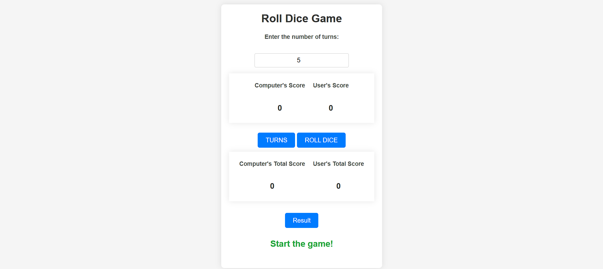
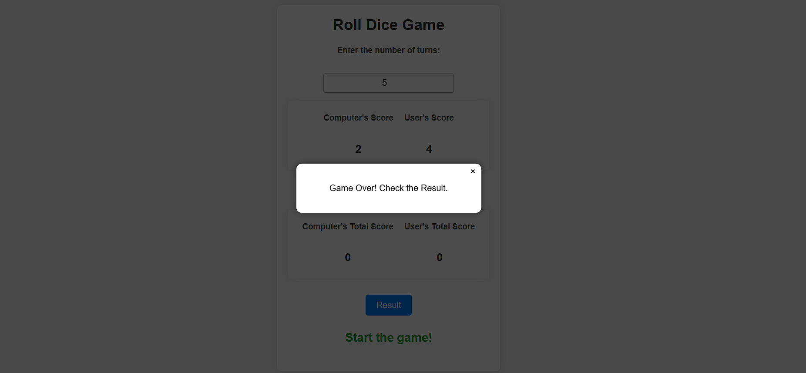
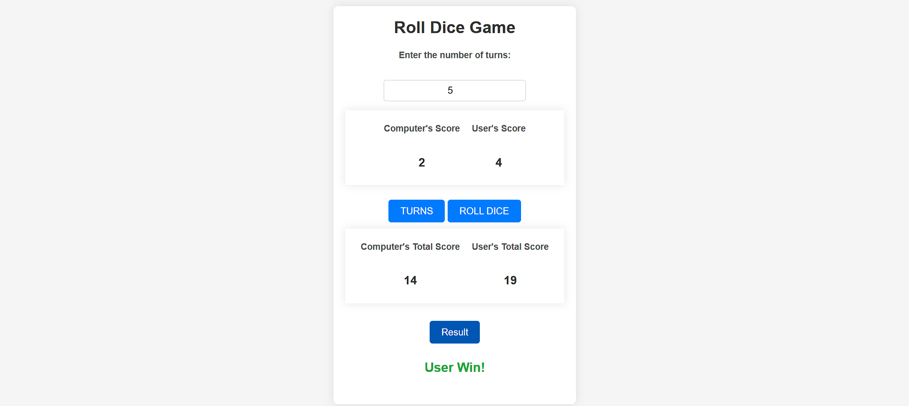

# 🎲 Dice Game (Flask + JavaScript)
Website link: https://roll-dice-game.onrender.com/ 
This project is a simple web-based dice game built using **Flask** for the backend and **JavaScript/jQuery** for the frontend. The game simulates a dice roll between a user and the computer, and the one with the highest total score after a set number of turns wins!

## 🚀 Features
- Set the number of turns before starting the game.
- Roll the dice for both the user and the computer.
- Display live scores after each roll.
- Show the final result (User Win, Computer Win, or Tie).
- Dynamic popups for game status and results.
- Simple and clean UI.
## 🖼️ Sample Screenshot





## 🛠️ Tech Stack
- **Frontend**: HTML, CSS, JavaScript, jQuery
- **Backend**: Flask (Python)
- **Communication**: AJAX (via jQuery)

## 📂 Project Structure
```
/                          # Root directory
|-- static/                # CSS, JavaScript, images
|-- templates/             # HTML templates
|   |-- home.html          # Main game UI
|-- util.py                # Game logic (turns, dice roll, scoring)
|-- app.py                 # Flask app and routes
|-- README.md              # Project documentation
```

## ⚙️ How to Run the Project
### Prerequisites
- Python 3.13.1
- Flask
- jQuery (linked in HTML)

### Steps
1. Clone the repository:
   ```bash
   git clone https://github.com/your-username/dice-game.git
   cd dice-game
   ```
2. Install Flask if not already installed:
   ```bash
   pip install Flask
   ```
3. Run the Flask server:
   ```bash
   python app.py
   ```
4. Open your browser and visit:
   ```
   http://127.0.0.1:5000
   ```

## 🎮 How to Play
1. Enter the number of turns you want to play.
2. Click "Set Turns".
3. Roll the dice by clicking the "Roll" button until all turns are completed.
4. View live scores and final results after each roll.

## 📋 API Endpoints
- **`/`** - Home route to render the game UI.
- **`/set_turns`** - POST request to set the number of turns.
- **`/diceRoll`** - GET request to roll the dice.
- **`/result`** - GET request to fetch the final game result.

## 📝 To-Do
- [ ] Add multiplayer support.
- [ ] Store previous game scores.
- [ ] Enhance UI with better animations.

## 🤝 Contributing
Contributions are welcome! Feel free to fork, submit issues, or create pull requests.


---
🎉 Enjoy the game and happy coding!

